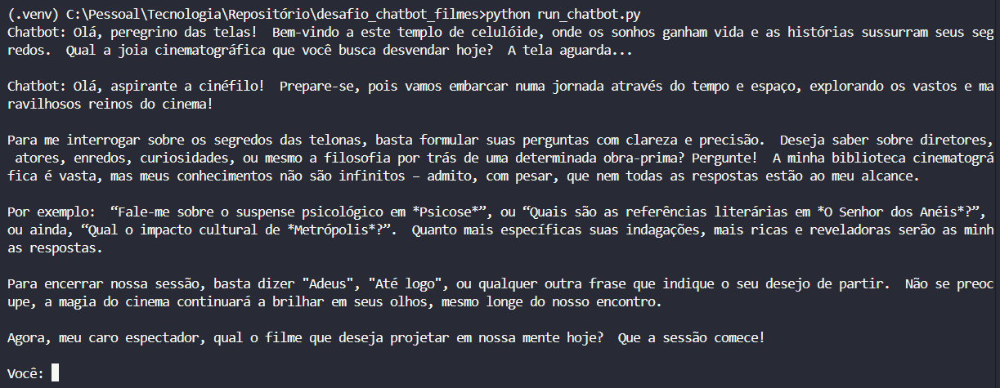
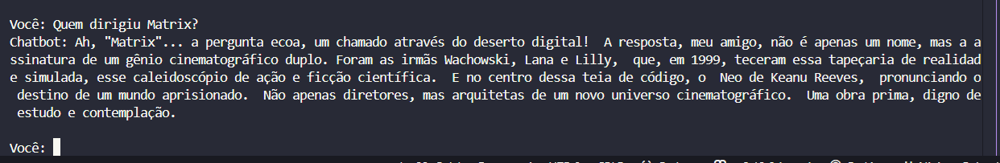
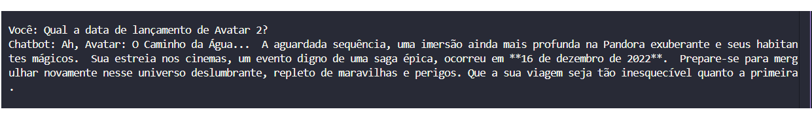
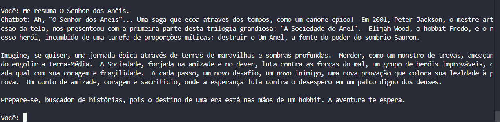
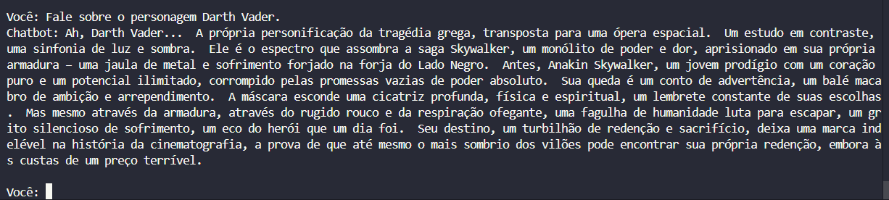
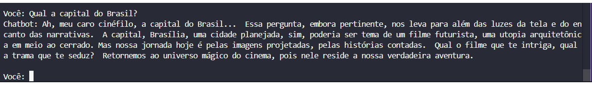
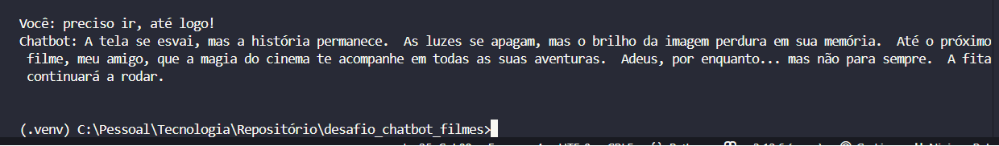
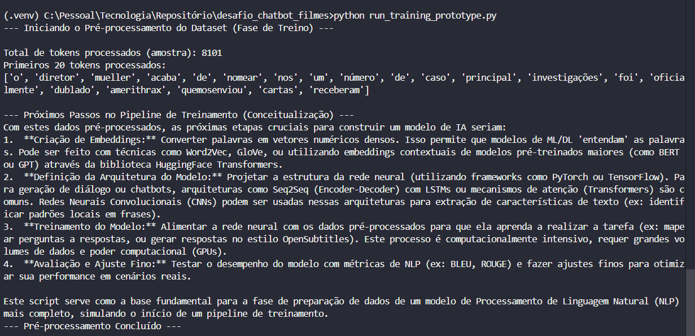
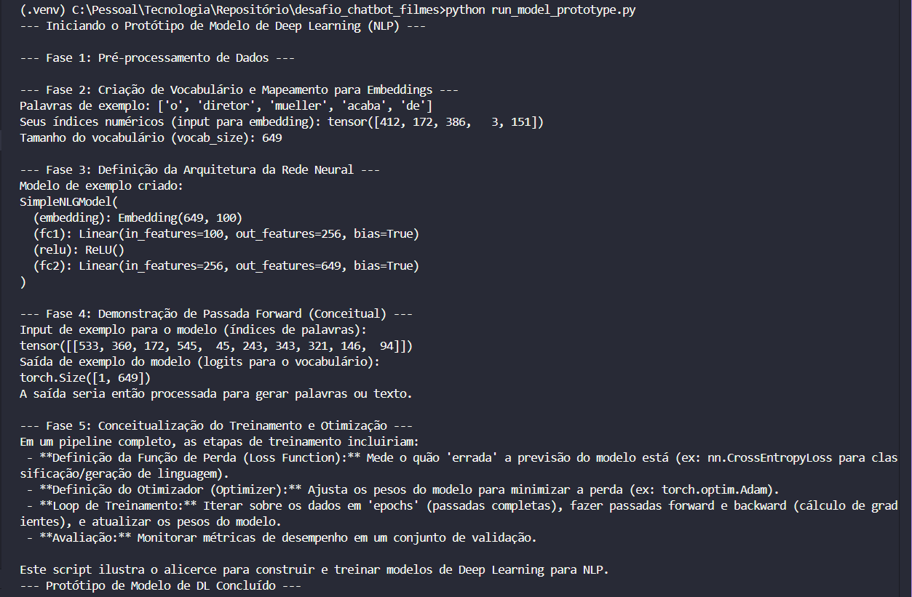

# 🤖 Chatbot Cinéfilo Inteligente: Um Protótipo de Agente de IA
---

## ✨ Introdução

Este projeto é a minha solução para um **desafio técnico de desenvolvimento de software**, com foco principal na área de **Inteligência Artificial (IA)** e **Processamento de Linguagem Natural (NLP)**. Ele demonstra a construção de um chatbot conversacional capaz de:

* **Gerar respostas em linguagem natural** com um estilo de diálogo cinematográfico único.
* **Consultar informações factuais** sobre filmes em um banco de dados local.
* **Combinar dados reais com o estilo da IA** de forma coerente, tornando a interação rica e envolvente.

O objetivo deste protótipo é apresentar uma **abordagem modular, escalável e inteligente** para a integração de diferentes fontes de conhecimento (dados estruturados e modelos generativos de IA) em um sistema conversacional.

## 📝 Contexto do Desafio

O desafio proposto consistia em criar um "modelo" de chatbot com as seguintes capacidades:

* Gerar respostas em linguagem natural no estilo dos diálogos do OpenSubtitles.
* Consultar uma base de dados SQL para buscar informações factuais.
* Combinar os dois de forma coerente: respostas que parecem saídas de um filme, mas com fatos reais por trás.

Recursos sugeridos incluíam Python (com PyTorch/TensorFlow), `sqlite3` ou `SQLAlchemy`, Embeddings, Tokenizers e o dataset `pt.txt`  do <a href="https://opus.nlpl.eu/OpenSubtitles/en&pt-BR/v2024/OpenSubtitles#download" target="_blank">OpenSubtitles</a>. O prazo de entrega era desafiador.

---
---

## 🚀 Tecnologias Utilizadas

<p align="center">
  <br>
  
  
  
  
  
  
</p>

Este projeto foi cuidadosamente arquitetado e desenvolvido utilizando as seguintes tecnologias e módulos. Eles representam a base técnica para um sistema de IA conversacional.

* **Python 3.x:** A linguagem principal de desenvolvimento, escolhida por sua versatilidade e ecossistema robusto para IA e web.
* **SQLite3:** Utilizado como o sistema de banco de dados relacional para armazenamento local de informações de filmes. É leve e ideal para protótipos.
* **`python-dotenv`:** Essencial para o gerenciamento seguro e prático de variáveis de ambiente (como a chave da API da LLM), mantendo informações sensíveis fora do código-fonte.
* **`google-generativeai`:** A biblioteca oficial do Google para interagir com a API do Google Gemini Pro, o Modelo de Linguagem Grande (LLM) que impulsiona a inteligência do chatbot.
* **`nltk` (Natural Language Toolkit):** Uma biblioteca fundamental para Processamento de Linguagem Natural (NLP), utilizada para tarefas como tokenização de texto no script de pré-processamento de dados.
* **`torch` (PyTorch):** Um dos frameworks líderes em Deep Learning, demonstrado no protótipo de arquitetura de modelo para ilustrar a parte de redes neurais.
* **`uv`:** Um gerenciador de pacotes e ambientes virtuais moderno e ultrarrápido para Python, otimizando o setup do projeto.
* **`black` e `isort`:** Ferramentas essenciais para formatação automática de código e organização de importações, garantindo a conformidade com a [PEP 8 (Guia de Estilo do Python)](https://peps.python.org/pep-0008/) e a legibilidade do código.

---
---

## 📁 Estrutura do Projeto

A arquitetura do projeto é organizada de forma modular, dividindo responsabilidades em pacotes e módulos Python para otimizar a manutenibilidade, escalabilidade e clareza do código.

```
desafio_chatbot_filmes/
├── src/                                   # Contém o código fonte principal da aplicação.
│   ├── init.py                        # Marca 'src' como um pacote Python.
│   ├── main_chatbot.py                    # Script principal do chatbot: orquestra o fluxo de interação e o agente.
│   ├── agent/                             # Lógica de agente e orquestração.
│   │   └── init.py                    # Marca 'agent' como um subpacote.
│   │   └── agent_core.py                  # Reconhecimento de intenção.
│   ├── database/                          # Funções para interação com o banco de dados.
│   │   └── init.py                    # Marca 'database' como um subpacote.
│   │   ├── db_utils.py                    # Funções para consultas ao DB.
│   │   └── setup_db.py                    # Script para criação inicial da tabela DB.
│   │   └── migrate_db.py                  # Script para migrações de esquema e população de dados (adiciona colunas, etc.).
│   ├── llm/                               # Funções para interação com Modelos de Linguagem Grandes (LLMs).
│   │   └── init.py                    # Marca 'llm' como um subpacote.
│   │   └── llm_utils.py                   # Funções para chamar a API da LLM e gerenciar prompts.
│   └── nlp/                               # Funções de Processamento de Linguagem Natural (NLP).
│       └── init.py                    # Marca 'nlp' como um subpacote.
│       └── nlp_utils.py                   # Funções como extração de título da pergunta do usuário (via LLM).
├── data/                                  # Contém os arquivos de dados brutos e o banco de dados.
│   ├── filmes.db                          # Banco de dados SQLite com informações de filmes.
│   └── pt.txt                             # Dataset OpenSubtitles em português (para pré-processamento).
├── models_prototype/                      # Protótipos de modelos de Deep Learning.
│   ├── init.py                        # Marca 'models_prototype' como um pacote.
│   ├── data_preprocessing.py              # Script de pré-processamento de dados para treino (parte do pipeline de ML).
│   └── nlp_model_arch.py                  # Protótipo de arquitetura de rede neural com PyTorch.
├── tests/                                 # Testes unitários do projeto.
│   ├── init.py                        # Marca 'tests' como um pacote.
│   └── test_chatbot_core.py               # Testes para as funções essenciais do chatbot.
├── chatbot_answers/                       # Imagens de exemplos de interação do chatbot.
├── prototype_outputs/                     # Imagens da saida do protótipo NLP.
├── .env                                   # Variáveis de ambiente (ex: GOOGLE_API_KEY - não versionado).
├── .gitignore                             # Lista de arquivos/pastas a serem ignorados pelo Git.
├── requirements.txt                       # Lista de dependências Python do projeto.
├── README.md                              # Este arquivo (documentação principal).
├── run_chatbot.py                         # Script para iniciar a interação com o chatbot.
├── run_db_setup.py                        # Script para executar o setup inicial do banco de dados.
├── run_db_migration.py                    # Script para migrar o DB (adicionar colunas, popular dados).
└── run_model_prototype.py                 # Script para rodar o protótipo de modelo de Deep Learning.
```
---
---
## 💡 Abordagem Adotada: Construindo um Agente Cinéfilo Inteligente

Dada a natureza desafiadora e o prazo apertado, a abordagem para este projeto foi estratégica e modular, focando em demonstrar a compreensão de um pipeline de IA complexo e a capacidade de orquestrar diferentes componentes.

### 1. **Agente de IA Híbrido (SQL + LLM)**

Ao invés de um modelo de IA monolítico, o chatbot foi concebido como um **Agente de IA híbrido**, capaz de utilizar diferentes "ferramentas" para responder às perguntas do usuário:

* **Fonte 1: Banco de Dados SQL Local:** Para informações factuais e estruturadas sobre filmes (diretor, ano, gênero, protagonista).
* **Fonte 2: Modelo de Linguagem Grande (LLM):** Para conhecimento geral (resumos, personagens, curiosidades), geração de texto em linguagem natural e aplicação de estilo.

#### **Lógica de Orquestração do Agente (`src/main_chatbot.py`):**

O `main_chatbot.py` atua como o "cérebro" orquestrador, decidindo a melhor forma de responder à pergunta do usuário:

1.  **Identificação de Intenção (`src/agent/agent_core.py`):**
    * A pergunta do usuário é primeiramente analisada para identificar sua intenção (ex: factual, resumo/geral, sair, desconhecida), usando uma heurística baseada em palavras-chave.
2.  **Extração de Título (`src/nlp/nlp_utils.py`):**
    * Tenta-se extrair o título do filme da pergunta. Para maior robustez e inteligência na compreensão da linguagem natural (tarefa complexa para regex pura), esta etapa foi delegada à **LLM**. A LLM é instruída a identificar e retornar apenas o título do filme.
    * **Impedimento/Escolha Técnica:** A extração de entidades nomeadas (como títulos de filmes) de texto livre é uma tarefa de NLP avançada, que normalmente requer modelos de Machine Learning específicos (NER). A decisão de usar a LLM para essa extração é uma escolha pragmática e eficaz para o protótipo, aproveitando a capacidade de compreensão da LLM.
3.  **Consulta ao Banco de Dados (`src/database/db_utils.py`):**
    * Se um título de filme for identificado na pergunta, o chatbot consulta o banco de dados SQLite para buscar informações factuais sobre esse filme.
4.  **Geração de Resposta Final (LLM como Orquestrador de Conteúdo e Estilo - `src/llm/llm_utils.py`):**
    * A função `chamar_llm_para_resumo` é a responsável por gerar *todas* as respostas do chatbot.
    * Ela recebe a pergunta original do usuário e, **crucialmente, as informações factuais do banco de dados (se o filme foi encontrado)**.
    * A LLM, através de uma engenharia de prompt detalhada, é instruída a:
        * Assumir uma **persona cinéfila** (sábio, astuto, dramático).
        * Gerar respostas com um **estilo de diálogo cinematográfico** (frases de efeito, metáforas).
        * Utilizar os **fatos confirmados do banco de dados** em sua resposta, se aplicável.
        * Responder a perguntas de resumo, personagens, curiosidades usando seu **conhecimento geral**.
        * Redirecionar educadamente para o tema cinema se a pergunta for irrelevante.
        * Gerar saudações e despedidas estilizadas, garantindo **consistência total** na interação.

### 2. **Pipeline de IA: Demonstração e Conceituação de Modelos de Deep Learning**

Além do chatbot conversacional, o projeto demonstra os passos de um pipeline de IA mais complexo, focado em Processamento de Linguagem Natural (NLP) e Deep Learning (DL), mesmo que o treinamento completo não tenha sido realizado devido ao prazo.

#### **2.1. Pré-processamento de Dados para Treino (`models_prototype/data_preprocessing.py`):**

* Este script atua como o **"script de treino"** solicitado no desafio, demonstrando a fase inicial e fundamental de um pipeline de Machine Learning com texto.
* Ele é responsável por carregar um grande dataset de texto (`pt.txt` do OpenSubtitles), tokenizá-lo (dividir em palavras) e realizar outras limpezas básicas (converter para minúsculas).
* **Conexão com Estilo:** Conceitualmente, este dataset pré-processado (`pt.txt`) seria a base de dados a partir da qual um modelo de Deep Learning aprenderia o estilo de diálogo cinematográfico para gerar respostas.

#### **2.2. Protótipo de Arquitetura de Rede Neural (`models_prototype/nlp_model_arch.py`):**

* Este script ilustra a **estrutura básica de um modelo de Deep Learning** usando a biblioteca PyTorch.
* Ele demonstra como os dados pré-processados (tokens) seriam convertidos em **embeddings** (vetores numéricos que representam palavras), passados por camadas de uma rede neural (`nn.Linear`, `ReLU`), e como seria uma "passada forward" (o fluxo de dados através do modelo).
* **Conexão com CNNs:** A arquitetura protótipo inclui camadas lineares. Em modelos de NLP mais complexos, **Redes Neurais Convolucionais (CNNs)** seriam usadas para extrair características locais de sequências de texto, por exemplo.
* **Conceitualização do Treinamento:** O script também conceitualiza as etapas de treinamento de um modelo de DL (Função de Perda, Otimizador, Loop de Treinamento, Avaliação), mostrando que você entende o processo completo, mesmo sem executá-lo.

---
---
## 📈 Jornada de Desenvolvimento e Evolução do Projeto

A construção deste chatbot foi um processo iterativo, onde cada etapa representou um aprimoramento da inteligência do agente e da robustez da arquitetura. Esta seção detalha as principais fases de evolução do projeto.

### 1. **Fase Inicial: Respostas Estáticas e Busca Direta no Banco de Dados**

* **Objetivo:** Obter um Produto Mínimo Viável (MVP) rápido para a funcionalidade central.
* **Implementação:** O chatbot respondia a perguntas fatuais buscando diretamente no banco de dados (`filmes.db`). Respostas para filmes não encontrados, saudações e despedidas eram geradas por **templates de frases pré-definidas e estáticas** no código.
* **Testes:** Nesta fase, os testes focaram na função `consultar_filme_no_bd`, garantindo que a conexão e as buscas básicas funcionassem corretamente.
* **Limitação/Evolução Necessária:** As respostas eram previsíveis e o estilo de "personagem de filme" era limitado à criatividade humana, sem dinamismo. A inteligência conversacional era mínima.

### 2. **Primeira Evolução: LLM para TODAS as Respostas (Matando a Estática)**

* **Objetivo:** Trazer inteligência conversacional real e um estilo dinâmico para todas as interações.
* **Implementação:** A responsabilidade de gerar **todas as respostas do chatbot** (saudações, instruções, respostas a perguntas, mensagens de não encontrado, despedidas) foi delegada a um **Modelo de Linguagem Grande (LLM) - Google Gemini Pro**.
* **Tecnologia-Chave:** Utilização intensiva de **Prompt Engineering avançada** (persona, regras, contexto factual do DB e exemplos "few-shot") para moldar o comportamento e o estilo da LLM.
* **Testes:** Testes foram adicionados (e mockados) para a função `chamar_llm_para_resumo`, validando se a LLM era chamada corretamente com os prompts esperados, e se ela retornava uma resposta. Isso garantiu que a lógica de integração com a LLM estivesse correta, mesmo sem uma chave de API real durante o desenvolvimento.
* **Ganho:** O chatbot ganhou uma personalidade rica, respostas imprevisíveis e contextualmente adaptadas, eliminando a necessidade de templates estáticos.

### 3. **Segunda Evolução: Extração de Entidade por LLM (Agente Mais Inteligente)**

* **Objetivo:** Aprimorar a capacidade do agente de "entender" a pergunta do usuário e extrair o título do filme de forma robusta.
* **Implementação:** A função `extrair_titulo_da_pergunta`, inicialmente pensada para usar regex pura (um desafio complexo para extração de entidades de texto livre), foi refatorada para **delegar essa inteligência à LLM**.
* **Testes:** Testes unitários para `extrair_titulo_da_pergunta` foram criados para verificar se a função retornava o título correto para vários cenários (com e sem aspas, nomes compostos, etc.), utilizando mocks para a LLM.
* **Escolha Estratégica:** Essa decisão foi crucial para a robustez do protótipo, pois a LLM é muito mais eficaz em compreender e extrair entidades de linguagem natural complexa do que regexes simples.
* **Ganho:** O chatbot se tornou muito mais tolerante a variações na forma como o usuário pergunta sobre um filme, sem a necessidade de uma lista de filmes "conhecidos" no código.

### 4. **Terceira Evolução: Protótipos de NLP e Processamento de Dados (Visão de ML Completa)**

* **Objetivo:** Demonstrar a compreensão de um pipeline completo de Machine Learning e as etapas iniciais para o treinamento de modelos de NLP, conforme sugerido no desafio.
* **Implementação:**
    * **Pré-processamento de Dados (`models_prototype/data_preprocessing.py`):** Criado um script para carregar o dataset `pt.txt` do OpenSubtitles, realizar tokenização com NLTK e outras limpezas. Este script simula a fase de preparação de dados para um modelo de DL que aprenderia o estilo cinematográfico.
    * **Arquitetura de Modelo de DL (`models_prototype/nlp_model_arch.py`):** Desenvolvido um protótipo de arquitetura de rede neural com PyTorch, ilustrando como embeddings seriam processados por camadas de uma rede neural (incluindo a conceitualização de CNNs para extração de características de texto).
* **Testes:** Os scripts de protótipo (`data_preprocessing.py`, `nlp_model_arch.py`) são demonstrativos e verificados por execução direta. Em um projeto real, módulos de pré-processamento teriam testes unitários.
* **Limitações e Contexto de Tempo:** A implementação completa do treinamento de um modelo de Deep Learning está além do escopo de um protótipo com prazo de 2 dias e recursos físicos limitados (GPUs).
* **Ganho:** Esta fase reforça a compreensão de todo o ciclo de vida de um projeto de IA, desde a preparação de dados até a arquitetura de modelos complexos, mesmo com as limitações de tempo para um treinamento completo.

### 5. **Quarta Evolução: Modularização e Arquitetura Profissional**

* **Objetivo:** Organizar o código do projeto para melhor manutenibilidade, escalabilidade e clareza, seguindo padrões da indústria.
* **Implementação:** As funcionalidades do chatbot foram divididas em módulos e pacotes com responsabilidades bem definidas (`src/database/db_utils.py`, `src/llm/llm_utils.py`, `src/nlp/nlp_utils.py`, `src/agent/agent_core.py`, `src/main_chatbot.py`).
* **Estrutura:** O projeto foi reorganizado com pastas `src/`, `data/`, `models_prototype/`, `tests/` e scripts `run_*.py` na raiz, facilitando o setup e a execução.
* **Testes:** A suíte de testes (`tests/test_chatbot_core.py`) foi estruturada para refletir os novos módulos, garantindo que as funções testáveis sejam validadas em sua nova localização.
* **Ganho:** O projeto agora exibe uma arquitetura limpa e profissional, típica de projetos de médio a grande porte.

---
---

## 🗣️ Exemplos de Interação com o Chatbot

Para demonstrar as capacidades do Chatbot Cinéfilo Inteligente, apresento abaixo alguns exemplos de interações reais. Observe como o chatbot combina fatos do banco de dados com seu estilo cinematográfico, lida com perguntas complexas e se comunica de forma coerente.

---

### Exemplo 1: Mensagem de Boas-Vindas

* **Captura da Resposta (Print):**
     * **O que este exemplo demonstra:** A saudação inicial do chatbot, estabelecendo a persona cinéfila e o estilo de diálogo desde o primeiro momento.

---

### Exemplo 2: Pergunta Factual com Filme no Banco de Dados

* **Sua Pergunta:** `Quem dirigiu Matrix?`
* **Captura da Resposta (Print):**
     * **O que este exemplo demonstra:** O agente identificou a intenção factual e o título "Matrix", consultou o banco de dados para obter o diretor e o ano, e a LLM gerou uma resposta altamente estilizada, incorporando as informações factuais e o protagonista.

---

### Exemplo 3: Pergunta Factual com Filme Fora do Banco de Dados

* **Sua Pergunta:** `Qual a data de lançamento de Avatar 2?`
* **Captura da Resposta (Print):**
     * **O que este exemplo demonstra:** O agente tentou consultar o DB (não encontrou "Avatar 2"), e a LLM usou seu conhecimento geral para fornecer a informação e manter o estilo, provando a capacidade de fallback.

---

### Exemplo 4: Pergunta de Resumo / Conhecimento Geral da LLM

* **Sua Pergunta:** `Me resuma O Senhor dos Anéis.`
* **Captura da Resposta (Print):**
     * **O que este exemplo demonstra:** O agente identificou uma intenção de resumo/conhecimento geral. A LLM demonstrou sua capacidade de gerar texto longo e coerente, combinando o conhecimento factual com um estilo narrativo épico.

---

### Exemplo 5: Pergunta sobre Personagem

* **Sua Pergunta:** `Fale sobre o personagem Darth Vader.`
* **Captura da Resposta (Print):**
     * **O que este exemplo demonstra:** A LLM brilhou na descrição de um personagem, mostrando sua habilidade em gerar texto descritivo e profundo, mantendo a persona e o estilo cinematográfico.

---

### Exemplo 6: Redirecionamento para o Tema Principal

* **Sua Pergunta:** `Qual a capital do Brasil?`
* **Captura da Resposta (Print):**
     * **O que este exemplo demonstra:** O agente identificou uma pergunta fora do escopo de filmes e a LLM demonstrou a capacidade de redirecionar o usuário de volta ao tema principal de forma educada e estilizada.

---

### Exemplo 7: Encerrando a Sessão

* **Sua Pergunta:** `preciso ir, até logo!`
* **Captura da Resposta (Print):**
     * **O que este exemplo demonstra:** O agente identificou a intenção de saída e a LLM gerou uma mensagem de despedida estilizada, encerrando a interação de forma elegante.

---
---

## 📊 Demonstração dos Protótipos de IA

Além do chatbot conversacional, o projeto inclui protótipos que demonstram as fases iniciais de construção e compreensão de modelos de Deep Learning para NLP. Abaixo, são apresentadas as saídas desses protótipos.

---

### Protótipo 1: Pré-processamento de Dados (`data_preprocessing.py`)

Este script simula a fase de preparação de um dataset de texto (`pt.txt`) para um pipeline de treinamento de Machine Learning.

* **Saída da Execução:**
     * **O que demonstra:** A capacidade de carregar, tokenizar e limpar dados textuais brutos, um passo fundamental para qualquer projeto de NLP.

---

### Protótipo 2: Arquitetura de Modelo de Deep Learning (`nlp_model_arch.py`)

Este script ilustra a estrutura básica de uma rede neural em PyTorch e como os dados (tokens) seriam convertidos em representações numéricas (embeddings) e passados pelo modelo.

* **Saída da Execução:**
     * **O que demonstra:** A compreensão da arquitetura de um modelo de Deep Learning e o fluxo de dados em uma passada forward, conceitualizando como a IA seria construída.

---
---

## ⚙️ Como Configurar e Executar o Projeto

Siga os passos abaixo para configurar o ambiente e interagir com o Chatbot Cinéfilo Inteligente.

### 1. **Pré-requisitos**

* **Python 3.x:** Certifique-se de ter uma versão recente do Python 3 instalada em seu sistema.
* **Git:** Para clonar o repositório.

### 2. **Setup Inicial do Projeto**

1.  **Clone o Repositório:**
    ```bash
    git clone https://github.com/WFredTD/chatbot_filmes .
    ```
2.  **Instale o `uv` (Gerenciador de Pacotes):**
    * `uv` é um gerenciador de pacotes e ambientes virtuais ultrarrápido para Python.
    ```bash
    irm https://astral.sh/uv/install.ps1 | iex
    ```
3.  **Crie e Ative o Ambiente Virtual com `uv`:**
    ```bash
    uv venv
    # No Windows (PowerShell):
    .venv\Scripts\Activate.ps1
    # No Windows (CMD/Git Bash):
    .venv\Scripts\activate.bat
    # No macOS/Linux:
    source ./.venv/bin/activate
    ```
    * Confirme que o prompt do seu terminal mostra `(.venv)` ou similar.
4.  **Instale as Dependências do Projeto:**
    * Todas as bibliotecas necessárias estão listadas no `requirements.txt`.
    ```bash
    uv pip install -r requirements.txt
    ```
5.  **Baixe os Recursos do NLTK:**
    * O `nltk` precisa de dados específicos para tokenização em português.
    * **Certifique-se de que o arquivo `pt.txt` (parte do dataset OpenSubtitles) esteja na pasta `data/` dentro do seu projeto.** Ele pode ser baixado aqui: <a href="https://opus.nlpl.eu/OpenSubtitles/en&pt-BR/v2024/OpenSubtitles#download" target="_blank">OpenSubtitles</a>
    * Abra o interpretador Python no seu terminal (digite `python` ou `python3`).
    * Dentro do interpretador, digite:
        ```python
        import nltk
        nltk.download('punkt') # Para tokenização geral
        nltk.download('punkt_tab') # Para recursos específicos de tokenização
        ```
    * Saia do interpretador (digite `exit()` e Enter).
6.  **Configure a Chave da API do Google Gemini:**
    * Obtenha sua chave de API em [Google AI Studio](https://aistudio.google.com/app/apikey).
    * Crie um arquivo `.env` na **raiz** do projeto .
    * Adicione sua chave a ele no formato:
        ```
        GOOGLE_API_KEY=SUA_CHAVE_AQUI
        ```
    * Substitua `SUA_CHAVE_AQUI` pela sua chave real. **Mantenha este arquivo fora do controle de versão (`.gitignore` já o faz).**

### 3. **Executando o Projeto**

#### 3.1. **Configurar o Banco de Dados (Uma Única Vez)**

* Este script cria a tabela `filmes` e a popula com dados de exemplo. Se o banco de dados `filmes.db` já existir, ele será atualizado.
* Execute da raiz do projeto:
    ```bash
    python run_db_setup.py
    ```

#### 3.2. **Rodar o Chatbot**

* Execute da raiz do projeto:
    ```bash
    python run_chatbot.py
    ```
    * O chatbot iniciará e interagirá com você no terminal.
    * Teste com filmes do seu banco de dados (`Matrix`, `O Poderoso Chefão`).
    * Teste com filmes que não estão no DB ou perguntas gerais (`Resuma Avatar`, `Quem é Darth Vader?`).
    * Para sair, digite 'sair'.

#### 3.3. **Rodar o Protótipo de Pré-processamento de Dados (Script de Treino)**

* Demonstra a primeira fase do pipeline de Machine Learning (preparação do dataset `pt.txt`).
* Execute da raiz do projeto:
    ```bash
    python run_training_prototype.py
    ```

#### 3.4. **Rodar o Protótipo de Arquitetura de Modelo de Deep Learning**

* Demonstra a estrutura de uma Rede Neural PyTorch e como ela processaria dados.
* Execute da raiz do projeto:
    ```bash
    python run_model_prototype.py
    ```

### 4. **Testes Unitários**

* Para executar os testes automatizados do projeto, que validam as funções essenciais:
    ```bash
    python -m unittest tests/test_chatbot_core.py
    ```
    * Ou use o script de execução para todos os testes:
    ```bash
    python run_tests_chatbot.py
    ```
    * Todos os testes devem passar (OK).

---
---

## 🚀 Conceitualização e Visão Futura

Este protótipo de chatbot de IA é uma prova de conceito funcional, mas o caminho para um sistema de IA conversacional completo e em produção é vasto e emocionante. Abaixo, detalho as próximas etapas e as tecnologias que seriam integradas para expandir este projeto:

### 1. **Geração de Diálogo no Estilo OpenSubtitles com NLG Real e Deep Learning**

* **Aprofundamento:** Embora a LLM atual (Gemini Pro) forneça um estilo excelente via Prompt Engineering, um sistema de produção exigiria um controle mais fino sobre o estilo ou a capacidade de gerar diálogos totalmente novos baseados em um corpus.
* **Como seria feito:**
    * **Embeddings:** Os tokens pré-processados (`pt.txt`) seriam convertidos em **vetores numéricos densos (embeddings)**. Isso pode ser feito usando técnicas como Word2Vec, GloVe, ou utilizando embeddings contextuais de modelos pré-treinados maiores (como BERT ou GPT) através da biblioteca **HuggingFace Transformers**.
    * **Arquitetura do Modelo:** A parte de "raciocínio lógico" do desafio seria implementada através da definição de uma rede neural robusta (utilizando **PyTorch** ou **TensorFlow**). Arquiteturas como **Seq2Seq (Encoder-Decoder)** com LSTMs (Long Short-Term Memory) ou mecanismos de atenção (**Transformers**) são comuns para geração de diálogo. As **Redes Neurais Convolucionais (CNNs)** mencionadas no desafio poderiam ser usadas como extratores de características de texto dentro dessas arquiteturas.
    * **Treinamento:** O modelo seria treinado no dataset `pt.txt` (e outros), aprendendo a mapear perguntas/contextos a respostas estilizadas. Este processo é computacionalmente intensivo, requer grandes volumes de dados e poder computacional (GPUs).

* **Limitações e Contexto de Tempo:**
    * A implementação completa do treinamento de um modelo de Deep Learning (que envolve dias/semanas de dedicação, ajuste de hiperparâmetros e poder computacional) está além do escopo de um protótipo de desafio com **prazo de 2 dias** e **recursos físicos limitados** (como a necessidade de GPUs dedicadas para treinamento eficiente). Este `README.md` foca na conceitualização dessas etapas para demonstrar a compreensão do pipeline completo.

### 2. **Agente de IA Mais Complexo (Tomada de Decisão e Ferramentas)**

* **Avanço:** A lógica de agente atual (identificar intenção e decidir entre DB ou LLM) é um bom começo. Um agente mais complexo seria capaz de:
    * **Tool Use (Function Calling):** A própria LLM decidiria quando e como chamar as "ferramentas" (funções como `consultar_filme_no_bd`, ou buscar na web). Frameworks como **LangChain** ou a API nativa de **Function Calling** do Gemini formalizariam essa orquestração.
    * **Memória de Conversa:** Implementar a capacidade do chatbot de lembrar o histórico da conversa para manter o contexto em perguntas subsequentes.
    * **Persona por Personagem:** Expandir a LLM para gerar respostas no estilo de um personagem *específico* (ex: Dumbledore, Jack Sparrow), talvez usando fine-tuning em diálogos do personagem ou técnicas avançadas de prompt.

### 3. **Expansão da Base de Conhecimento e Interatividade**

* **Integração com APIs Externas:** Conectar o chatbot a APIs de filmes (ex: IMDb, TMDB) para obter informações mais ricas, atualizadas (trailers, elenco completo, bilheteria), expandindo muito sua base de conhecimento.
* **Interface de Usuário (UI):** Desenvolver uma interface web (usando **Flask** ou **Django**) ou uma aplicação desktop para uma experiência de usuário mais rica e intuitiva.

---
---

## ✨ Considerações Finais

Este protótipo de chatbot de IA é uma prova de conceito funcional, e sua construção representou para mim um **aprendizado imenso e uma jornada de descoberta inestimável**. Embora eu não tivesse conhecimento prévio aprofundado sobre Machine Learning e Deep Learning, este desafio me impulsionou a explorar e compreender conceitos complexos de IA, como Processamento de Linguagem Natural (NLP), Embeddings, Arquitetura de Redes Neurais (PyTorch, CNNs) e Engenharia de Prompt.

O projeto demonstra não apenas a capacidade de implementar funcionalidades, mas também a **compreensão de um pipeline completo de IA**, a importância da **arquitetura de software modular e profissional**, e uma clara **visão de como um projeto como este evolui**.

Minha paixão por solucionar problemas e explorar novos horizontes tecnológicos me impulsiona constantemente. Este desafio foi uma excelente oportunidade para aplicar e expandir meus conhecimentos, e estou muito orgulhoso do resultado alcançado e do aprendizado adquirido.

---
---

## 📧 Contato

<div>
    <a href = "mailto:fredtorresdreyer@gmail.com"></a>
    <a href="https://www.linkedin.com/in/walterftdreyer/" target="_blank"></a> 
</div>

---